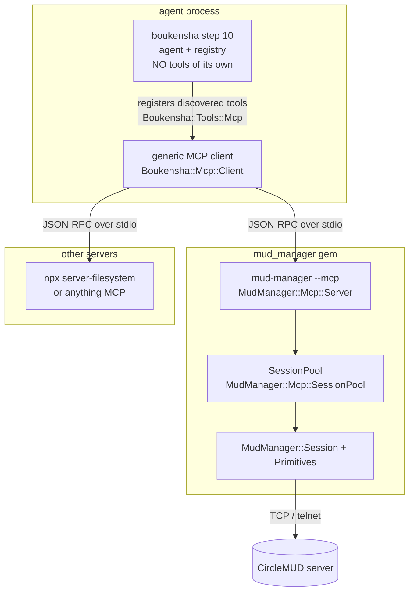

# MUD Manager × MCP — how it's integrated

This documents how the `mud-manager` MCP daemon is wired into **boukensha
step 10** (`week1_baseline/ruby/10_standard_tool_library`) so that a real agent
run can drive the MUD through MCP.

The headline, which drives everything else:

> **boukensha ships no tools of its own.** It is an MCP *host*. Every tool the
> agent can call arrives from an MCP server named in `settings.yaml`. The MUD
> is not a feature of the agent — it is a server you plug in, exactly like a
> filesystem server. An agent with an empty `mcp_servers:` block can only talk.

It exists to clear up four specific points of confusion:

1. **`mud_manager` is one gem, one binary** — `Session`/`Primitives` (the
   domain) and the `mud-manager` daemon (MCP + raw JSON-line interfaces over
   that domain) ship together from `week0_explore/mud_manager`. There used to
   be a second `mud_manager_mcp` package; it was folded in (see
   [`docs/plans/mud_manager/single_gem.md`](plans/mud_manager/single_gem.md)).
2. **The fake MUD is a test double** — it is never used in a real run.
3. Running the `boukensha` terminal command goes **through MCP** — it is the
   only path, not an example script.
4. **Nothing in boukensha knows what a MUD is.** Grep it: there is no `mud.rb`.

---

## 1. The three pieces and how they relate



| Component | Where | Role | Changed? |
|-----------|-------|------|----------|
| **`mud_manager`** (gem) | `week0_explore/mud_manager` | One gem, one `mud-manager` binary: `Session` (telnet, login dance) + `Primitives` (enum-validated command strings) *and* the daemon (`MudManager::Mcp::*`) that owns the session(s) and speaks **MCP** + a raw JSON-line protocol over stdio. | **Folded together.** Used to be two gems (`mud_manager` + `mud_manager_mcp`); see [`docs/plans/mud_manager/single_gem.md`](plans/mud_manager/single_gem.md). Behavior — the wire protocol, tool names, schemas — is unchanged. |
| **boukensha step 10** | `week1_baseline/ruby/10_standard_tool_library` | The agent, and a general **MCP host**. Owns the loop, the registry, and `Mcp::Client` + `Tools::Mcp`. Owns **no tools**. | Tool modules deleted; `mcp_servers:` config added. |

`mud_manager` is a single, dependency-free gem: `gem install mud_manager` gets
you `Session`, `Primitives`, and the `mud-manager` binary in one shot — no
second gem to keep version-locked, and no Ruby toolchain archaeology for a
Rust/Go/Python bootcamper who just wants the binary.

boukensha's gemspec declares **no tool dependencies at all** — it never needed
`mud_manager`, because the only thing that would have needed it was the
in-process `Tools::Mud` that no longer exists. `mud_manager` is a daemon
subprocess to boukensha, not a library it links against.

---

## 2. Where the agent's tools come from

There are exactly three layers, and only the config is MUD-aware:

| Layer | What it knows |
|-------|---------------|
| `Boukensha::Mcp::Client` | MCP over stdio. Takes `command` / `args` / `env`, handshakes, lists and calls tools. |
| `Boukensha::Tools::Mcp` | Registers a server's discovered tools into a registry, applying an optional `prefix:`. The only file left under `tools/`. |
| `settings.yaml` | Which servers exist. **This is the only place the word "mud" appears.** |

```yaml
mcp_servers:
  mud:
    command: mud-manager
    args:    [--mcp]
    prefix:  tbamud          # → tbamud__look, tbamud__attack
    env:
      MUD_HOST:     your.mud.host
      MUD_NAME:     Gandalf
      MUD_PASSWORD: secret

  filesystem:
    command:  npx
    args:     [-y, "@modelcontextprotocol/server-filesystem", /tmp]
    prefix:   fs             # → fs__read_file, fs__list_directory
    required: false
```

| Key | Default | Meaning |
|-----|---------|---------|
| `command` | — | Executable to spawn. Resolved by the OS (PATH or a path), so a relative path depends on your cwd. Nothing hunts for a binary on your behalf. |
| `args` | `[]` | Its argv. |
| `env` | `{}` | Extra environment. A spawned server inherits boukensha's environment, and these keys override it — so config wins over an exported `MUD_HOST`. |
| `prefix` | none | Scopes discovered names (`fs` → `fs__read_file`). |
| `required` | `true` | `false` downgrades a failure to start into a warning. |

Three rules worth knowing:

- **Prefixing is client-side.** The daemon advertises `look`; the agent
  registers `tbamud__look` and calls `look` back over the wire. The server never
  hears the prefix. `prefix:` is optional — omit it and names stay bare.
- **Collisions raise**, always — including for `required: false` servers. The
  filesystem server advertises `read_file`; two servers advertising it would
  silently clobber each other, so registration errors and names the fix. A
  server failing to *start* is excusable; a config asking for two tools with one
  name is not, because the only way to continue is to silently drop one.
- **Servers spawn eagerly** at boot: every entry costs a subprocess and a
  handshake whether or not the LLM ever calls it. Fine at two; revisit past that.

There is no mode switch, no `mud:` argument to `Boukensha.run`, and no
`BOUKENSHA_MUD_MODE`. All of it was scaffolding for an in-process MUD session
that no longer exists.

---

## 3. Running the real `boukensha` terminal command

This uses a **real** MUD — no fake.

`~/.boukensha/settings.yaml`:

```yaml
mcp_servers:
  mud:
    command: mud-manager        # or: command: ruby, args: [/path/to/bin/mud-manager, --mcp]
    args:    [--mcp]
    prefix:  tbamud
    env:
      MUD_HOST:     your.mud.host
      MUD_PORT:     4000
      MUD_NAME:     Gandalf
      MUD_PASSWORD: secret
```

Then:

```sh
export ANTHROPIC_API_KEY=...
boukensha
```

The REPL banner reports what came up, which doubles as "what can this agent
actually do?":

```
  servers:   mud (26)  filesystem (14)
```

What happens on the first gameplay tool call:

```
boukensha REPL
  └─ register_mcp_servers                          # the ONLY tool source
       └─ Tools::Mcp.register(command:, args:, env:, prefix: "tbamud")
            └─ Mcp::Client.spawn("mud-manager --mcp")   # subprocess
                 └─ initialize + tools/list             # 26 tools discovered
            └─ each tool registered as tbamud__<name>
  ── agent asks the LLM, LLM calls tool "tbamud__look" ──
       └─ Mcp::Client.call_tool("look")  → JSON-RPC → daemon   # prefix stripped
            └─ SessionPool lazily connects + runs the login dance (creds from env)
            └─ MudManager::Session.drain → send → read_until_prompt
       └─ text returned to the LLM
```

Session lifecycle (connect/login/reconnect) is **hidden inside the daemon** —
the LLM only ever sees gameplay tools. Credentials come from the server entry's
`env:`, never from tool arguments.

---

## 4. The fake MUD is a test double only

`MudManager::FakeMud` is an in-process CircleMUD stand-in (it walks the login
dance and echoes commands). It exists so the daemon, the client, and boukensha's
MCP layer can be tested **offline, with no live server and no API key**.

It is used in exactly two places, both non-production:

- the test suites (`rake test`), and
- the `--dry` flag of the demo scripts.

A real run (§3) never touches it — the `env:` in your server entry carries real
credentials to the daemon, which connects over TCP to the real server.

---

## 5. How to verify it's correctly integrated

**Offline smoke test** (no API key, no MUD — uses the fake):

```sh
cd week1_baseline/ruby/10_standard_tool_library
ruby examples/mcp_mud_demo.rb --dry
```

Expected: `daemon: {...}`, `tools: 26 — tbamud__look, tbamud__examine, …`, a
few calls dispatched through a real registry, and `[dry run OK …]`. The
`tbamud__` names confirm the prefix landed.

**Automated proof — boukensha's suite**
(`week1_baseline/ruby/10_standard_tool_library` → `rake test`, 18 tests):

| Test file | Proves |
|-----------|--------|
| `test_mcp_client.rb` | `Mcp::Client` handshakes, discovers, and calls against a real spawned server; tool errors come back as data, not exceptions. |
| `test_tools_mcp.rb` | generic registration with an explicit `command:`; `prefix:` applied client-side while the server still sees bare names; `prefix: nil` keeps names bare; collisions raise. |
| `test_mcp_servers_config.rb` | `Config#mcp_servers` parsing + defaults; required vs optional spawn failure; `mud` is just another server; a collision raises even for an optional one. |

**Automated proof — the daemon's suite**
(`week0_explore/mud_manager` → `rake test`, 19 tests):

| Test file | Proves |
|-----------|--------|
| `test_spec.rb` | tool schemas + `primitives.json` generated from the canonical Ruby table. Since boukensha no longer implements gameplay tools, this daemon is the only implementation left — so this test is now the surface's only guard. |
| `test_mcp_server.rb` / `test_json_line_server.rb` | both stdio protocols drive a session; structured errors. |
| `test_mcp_client_e2e.rb` | a real `MudManager::Mcp::Client` spawns the real `mud-manager` subprocess against a FakeMud. |
| `test_boukensha_integration.rb` | boukensha's **own** `Registry`/`RunDSL`/`dispatch` drive the MUD via MCP. |

The daemon keeps its own `MudManager::Mcp::Client` for `test_mcp_client_e2e.rb`.
That duplication is deliberate: the daemon serves five language tracks, so a
test-only dependency on one of them (boukensha) would be the wrong edge. It is
test-scoped and shouldn't grow features.

---

## 6. For future cases

- **Add/rename a gameplay tool:** edit the canonical Ruby table in
  `week0_explore/mud_manager/lib/mud_manager/mcp/tool_spec.rb`. Every consumer
  (MCP schemas, raw protocol, `primitives.json`) updates from that one place.
  There is no longer a second copy in boukensha to keep in sync — that was the
  point.
- **Regenerate the language-neutral spec:** `mud-manager --dump-spec`
  (or `rake spec`). Ruby is canonical; enums are pulled live from
  `MudManager::Primitives` constants, so they can never drift.
- **Add a new language track (Python/Go/Rust/Java):** point that SDK's MCP
  client at `mud-manager --mcp`. It gets the same 26 typed tools with zero
  telnet/login code. The Ruby track is no longer a special case — it configures
  a server entry like everyone else.
- **Give the agent file access, shell access, anything:** add an `mcp_servers:`
  entry. No boukensha code. This is what replaced the deleted `Tools::FileSystem`
  and `Tools::Shell`; note the trade — a third-party filesystem server needs
  node/npx, and its root is fixed in `args:` rather than tracking `working_dir`.
- **Async/unprompted output** (combat while idle): call the `poll` tool — it
  returns buffered output without sending a command.
- **Multiple characters/sessions:** the daemon's `SessionPool` already supports
  multiple named sessions (the raw JSON-line protocol addresses them by id);
  the MCP facade currently uses one implicit session per subprocess. Two MUDs is
  two sessions in one server, not two servers.
- **A tool returns an image or an embedded resource:** non-text content blocks
  are currently *dropped* (`content.map { |c| c["text"] }.compact`), yielding an
  empty string rather than an exception. No MUD tool can hit this; fix it when a
  server actually needs it.
- **A third-party server has genuinely optional parameters:** the backends
  currently advertise every listed param as required (`backends/anthropic.rb`).
  Harmless for the MUD's own spec, wrong in general. The fix is to plumb
  `inputSchema["required"]` through `Boukensha::Tool` — a change affecting *all*
  tools, so it deserves its own plan.

See also: [`docs/plans/mud_manager/generic_interfacing.md`](plans/mud_manager/generic_interfacing.md),
[`generic_mcp_client.md`](plans/mud_manager/generic_mcp_client.md), and
[`single_gem.md`](plans/mud_manager/single_gem.md) (design rationale) and
[`week0_explore/mud_manager/README.md`](../week0_explore/mud_manager/README.md)
(package reference).
